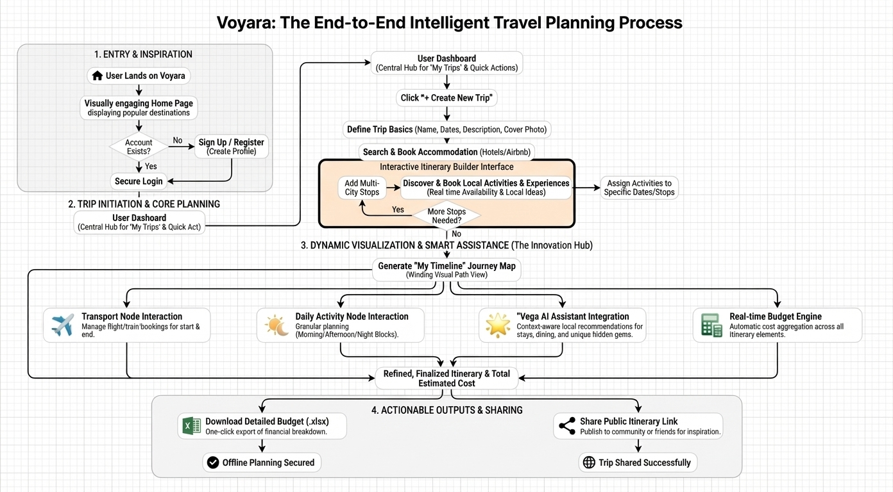

# 🗺️ Voyara: Intelligent End-to-End Travel Planning Architecture

This document provides a detailed walkthrough of the Voyara user journey and system architecture. Our platform is designed to transform a fragmented, stressful planning process into a seamless, intelligent, and visually engaging experience.

The flowchart below illustrates the complete lifecycle of a trip on Voyara, divided into four strategic phases: **Inspiration, Core Planning, Dynamic Visualization (The Innovation Hub), and Actionable Outputs.**

---

### 📊 System Flowchart Overview

*(Note: This diagram visualizes the user flow and backend process integration.)*

---

### 1️⃣ Phase 1: Entry & Inspiration
*The journey begins with engagement and frictionless onboarding.*

The flow starts when a **User Lands on Voyara**, immediately greeted by a visually engaging Home Page displaying curated, popular destinations to spark inspiration.
* **Smart Authentication:** The system intelligently checks for existing accounts. New users are guided through a quick **Sign Up/Register** process to create their profile, while returning users enjoy a secure, streamlined **Login**.

### 2️⃣ Phase 2: Trip Initiation & Core Planning
*Building the structural foundation of the itinerary.*

Once authenticated, the user enters the **User Dashboard**, the central hub for managing trips.
* **Defining the Basics:** Clicking **"+ Create New Trip"** initiates the process, where users define essential parameters: Trip Name, Dates, Description, and a Cover Photo.
* **The Interactive Itinerary Builder Interface:** This is the core planning engine. Unlike static forms, this is a dynamic loop where users can:
    * **Add Multi-City Stops:** Building complex routes easily.
    * **Discover & Book Local Activities:** A key differentiator—surfacing real-time availability and unique local experiences, not just generic tourist spots.
    * **Assign Activities:** Dragging and dropping experiences to specific dates and stops.

### 3️⃣ Phase 3: Dynamic Visualization & Smart Assistance (The Innovation Hub)
*Where Voyara differentiates itself from standard planners. We replace spreadsheets with intelligent visualization.*

Once the basic structure is set, the system **Generates the "My Timeline" Journey Map**. This replaces boring list views with a beautiful, winding visual path representing the trip flow.

From this central timeline, four parallel, intelligent processes run simultaneously:

1.  **✈️ Transport Node Interaction:** Manages logistical bookings for start endpoints (flights/trains).
2.  **☀️/🌙 Daily Activity Node Interaction:** Allows for granular, block-based planning (Morning/Afternoon/Night) for each day.
3.  **⭐ "Vega" AI Assistant Integration (Star Feature):** Our context-aware AI co-pilot. It analyzes the current itinerary data to provide proactive, hyper-local recommendations for dining, hidden gems, and activities that fit the user's schedule and preferences.
4.  **🧮 Real-time Budget Engine:** Automatically aggregates costs across all itinerary elements (transport, stays, activities) to provide a live financial view.

All four parallel streams converge to produce a **Refined, Finalized Itinerary & Total Estimated Cost**.

### 4️⃣ Phase 4: Actionable Outputs & Sharing
*Translating digital plans into real-world utility.*

The finalized itinerary is not stuck on the platform. We provide two critical, actionable outputs:
* **📗 Download Detailed Budget (.xlsx):** A single-click export of the entire trip's financial breakdown into Excel, ensuring **Offline Planning is Secured**.
* **🔗 Share Public Itinerary Link:** Generates a viewable link to publish to friends, family, or the community for inspiration, ensuring the **Trip is Shared Successfully**.