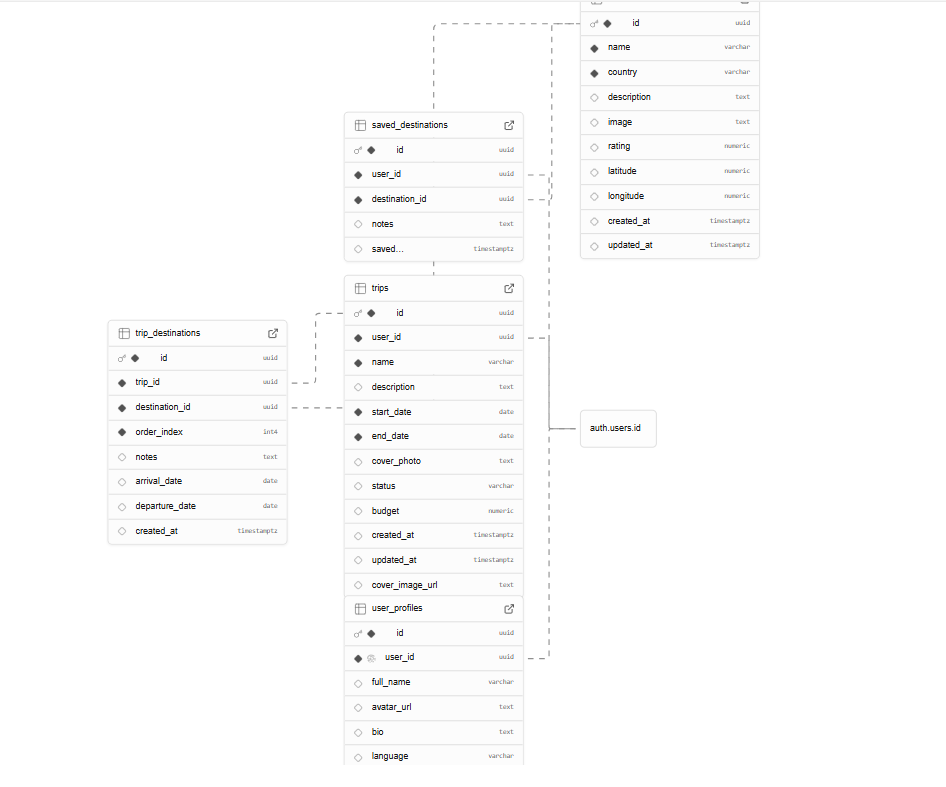

VOYARA – Travel Planning & Itinerary Management System

Voyara is a travel planning platform that helps users plan trips, build itineraries, manage budgets, explore destinations, and interact with a travel community.

This document describes the 
-**UI wireframes**  
-**Data Flow Diagram (DFD)** 
-**Database Schema** 
of the system.

## 1 - UI Wireframes – Application Flow

**Screen Sequence:**

Login → Registration → Landing Page → Create Trip → Build Itinerary →  
Trip Listing → Profile → Search → Itinerary View → Community → Calendar → Admin Panel

- Covered Features
- Authentication (Login & Registration)
- Trip creation and itinerary planning
- Search, community, and calendar views
- Admin dashboard and analytics

## Major Screens Overview

- **Login & Registration:** Secure authentication and user onboarding  
- **Landing Page:** Banner, search, filters, previous trips  
- **Trip & Itinerary:** Destination, dates, activities, budgets  
- **Trip Listing:** Ongoing, upcoming, and completed trips  
- **Profile:** User details and trip history  
- **Search:** City and activity-based exploration  
- **Community:** Posts, likes, and comments  
- **Calendar:** Date-wise trip visualization  
- **Admin Panel:** Analytics, reports, and insights  

## 2 - Data Flow Diagram (DFD – Level 1)

### DFD Components

**External Entities**
- E1: User (Traveler)
- E2: Admin

**Processes**
- P1.0 Authentication & Profile Management  
- P2.0 Trip & Itinerary Management  
- P3.0 Search & Browse Content  
- P4.0 Community Interaction  
- P5.0 Admin Analytics  

**Data Stores**
- D1 User Database  
- D2 Trip & Itinerary Database  
- D3 Activity / Location Database  
- D4 Community Database  

## 3 - Database Schema

### Key Tables

- **user_profiles** – Stores user profile details linked to authenticated users  
- **trips** – Contains trip information such as dates, budget, status, and cover image  
- **destinations** – Stores destination details including location, rating, and description  
- **trip_destinations** – Maps destinations to trips and maintains visit order and dates  
- **saved_destinations** – Stores destinations bookmarked by users  

### Relationships

- One user can create multiple trips  
- A trip can include multiple destinations  
- Destinations can belong to multiple trips  
- Users can save destinations independently of trips  

### Design Notes

- Normalized schema for scalability  
- Supports itinerary sequencing and budgeting  
- Easily extensible for future features and analytics  

##  Architecture Summary

- Modular and scalable system design  
- Clear separation of system responsibilities  
- User-focused navigation with admin-level analytics  
